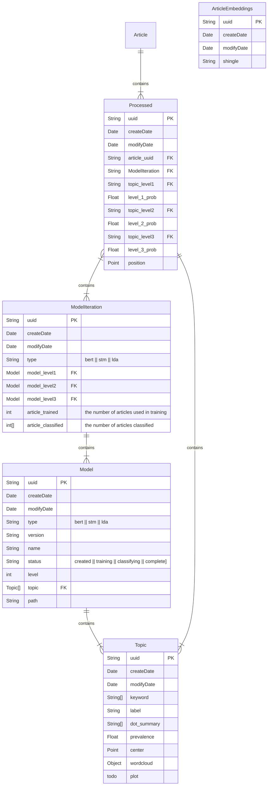

# Project Design

## Design Overview

### System Overview Diagram

### Data structures

```mermaid
erDiagram
    ModelIteration ||--|{Model: contains
    Model ||--|{Topic : contains
    Processed }|--|{ ModelIteration : contains
    Processed ||--|{ Topic: contains
    Article ||--|{ Processed: contains
    ModelIteration {
        String uuid PK
        Date createDate
        Date modifyDate
        String type "bert || stm || lda"
        Model model_level1 FK
        Model model_level2 FK
        Model model_level3 FK
        int article_trained "the number of articles used in training"
        int[] article_classified "the number of articles classified"
    }

    Model{
        String uuid PK
        Date createDate
        Date modifyDate
        String type "bert || stm || lda"
        String version
        String name
        String status "created || training || classifying || complete]"
        int level
        Topic[] topic FK
        String path
    }

    Topic{
        String uuid PK
        Date createDate
        Date modifyDate
        String[] keyword
        String label
        String[] dot_summary
        Float prevalence
        Point center
        Object wordcloud
        todo plot "<!-- plot over time, number of articles, sentiment around it. -->"
    }

    Processed {
        String uuid PK
        Date createDate
        Date modifyDate
        String article_uuid FK
        String ModelIteration FK
        String topic_level1 FK
        Float level_1_prob
        String topic_level2 FK
        Float level_2_prob
        String topic_level3 FK
        Float level_3_prob
        Point position
    }

    ArticleEmbeddings {
        String uuid PK
        Date createDate
        Date modifyDate
        String shingle

    }
```

### Communication Protocol Table

### Sequence Diagrams

## GUI Design

